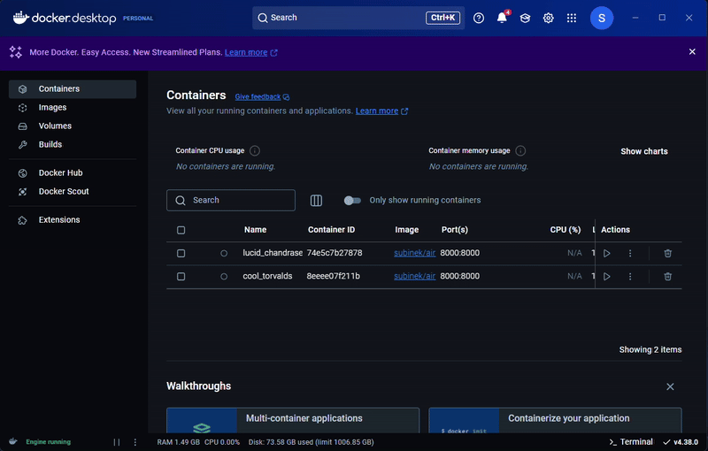

# Airway Segmentation Module for Slicer

This module helps you to integrate the airway segmentation models to Monai label and to the Slicer.

## How to run the App using Docker Hub

_This is the preffered way to RUN airway segmentation model using Slicer UI_

- The Docker image is available on Docker Hub: [Link](https://hub.docker.com/r/subinek/airway_segmentation_slicer).
- You can easily download and run it using the latest version of Docker Desktop. Please refer to the video below for a step-by-step guide.



## How to Run the App Using Docker CLI

This will allow you to run the model on the docker CLI
This section outlines how to run the airway segmentation model using the Docker command line interface.

1. Download and unzip this folder, and cd into the folder

2. Execute the following command to build the docker

```bash
    docker build -t airway_segmentation .
```

3. Execute this following command to run the docker

```bash
    docker run -p 8000:8000 airway_segmentation
```

4. Follow steps on `Running Slicer`

## How to run the App on CLI

1.  download and unzip this folder.

    - The pre-trained model for the segmentation can be downloaded from the following links

    - Upper airway segmentation (Pre-trained model): [Download Here](http://www.subinek.com)

    - Place the downloaded model inside `apps/model/`

    - The name of the model file should be `pretrained_airway_segmentation.pth`

2.  Setup Monai Label (Python >=3.10)

```bash
    pip install torch
    pip install monailabel
```

- Note: Lower version of python have issues with running SAM2

3.  After unzipping run the following commands in your conda evirnment to initialize the monai label server.
    Below are commands to start the airway segmentation models. Ensure that you specify the correct app and studies path according to your system.

```bash
    monailabel start_server --app apps/radiology --studies datasets/ --conf models airway_segmentation
```

This will start the MONAI Label server locally on your PC at https://localhost:8000.

### Running Slicer:

1.  Open the .nrrd upper airway volume file you have.
2.  Navigate to the MONAI Label extension. If it's not installed, please refer to the installation instructions for MONAI Label in Slicer.
3.  Enter 'https://localhost:8000' in the URL section and refresh to detect the MONAI Label server.
4.  Once detected, you should see the details filling up in the Slicer module.
5.  Go to the Inferencing section of the MONAI Label extension and click "Start" to begin the segmentation process.

The model may take a few minutes to run. Once the results are ready, you will see the segmentations displayed on the image.

## Note

This module consists of two custom python files located in the app folder. After installing the MONAI radiology app, you can just place these files into the app/radiology folder if you are already familiear with the Monai label.

```
- File 1: `apps/radiology/lib/configs/airway_segmentation.py`
- File 2: `apps/radiology/lib/infers/airway_segmentation.py`
```

## Citation

Please cite the following papers when using the code:

1. S Erattakulangara, Exploring Advanced MRI Airway Segmentation Techniques for Voice Analysis: A Comparative Study of 3DUNet, 2DUNet, 3D Transfer Learning UNet, and 3D Transformer UNet
2.
